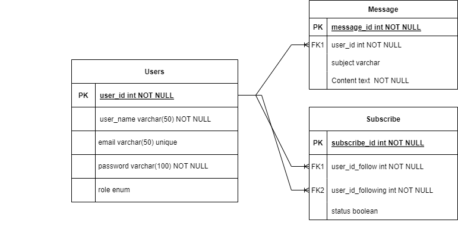

# API for executing queries

## Tech Stack
- [NodeJs](https://nodejs.org/en/about/)
- [Express](https://expressjs.com/)
- [MySql](https://www.mysql.com/)

# Getting Started

## Set up in Your local system
0. Setup Mysql server on your system before starting to use this server. `Important`
1. You must have nodejs and mysql installed in your local system.
2. Run mysql server 
3. In ./db.js  at line number 9 replace `your-password` with your mysql server password and also sepecifie specific user 
4. In ./db.js at line 18 specify your mysql server password
5. In ./utils/uploadDummyData.js at line 3 also replace `your-password` with your server password.
6. install dependencies and run the server
   ```sh
   npm install
   npm start
   ```
   This will make the server run at `http://localhost:8000/`


## Schema


## APIs

| Routes                             | parameters | body                             | Description                 |
| --------                           | --------   | --------                         | --------                    |
| `Get` /api/v1/users/               | --------   | --------                         | getAllUsers                 |
| `Post`/api/v1/users/signup         | --------   | user_name, email, password, role | signup                      |
| `Get` /api/v1/users/subscribers    | --------   | id                               | getSubscribers              |
| `Get` /api/v1/users/role           | --------   | role                             | getUserByRole               |
| `GET` /api/v1/messages/            | --------   | --------                         | getAllMessages              |
| `Post` /api/v1/messages/           | --------   | subject, content, user_id        | createMessage               |
| `Get` /api/v1/messages/:user_id    | user_id    | --------                         | getMessagesReceivedByUserId |
| `Get` /api/v1/messages/my/:user_id | user_id    | --------                         | getMessageProduceByUserId   |
| `Post` /api/v1/subscribe/          | --------   | user_id_follow, user_id_following| subscribeUser               |


